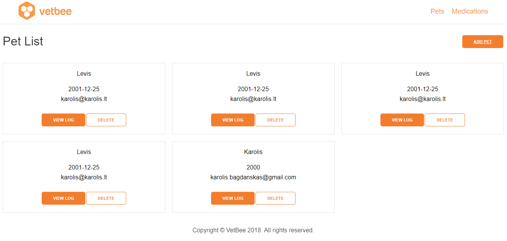
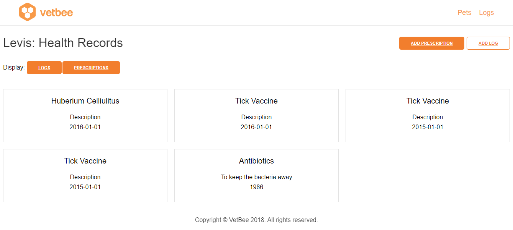

# Vet Bee - Future For Your Pet Health 🐱

  <summary>Jump to topic!</summary>
  <ol>
    <li>
    <a href="#introduction">Introduction</a>
     <ul>
			  <li>
			   <a href="#backend">Back-End</a>
		   </li>
       <li>
			   <a href="#server">Server</a>
		   </li>
     </ul>
   </li>
	   <li>
	     <a href="#screenshots">Screenshots</a>
		 </li>
   <li>
     <a href="#getting-started">Getting Started</a>
       <ul>
         <li>
					 <a href="#installation">Installation</a>
				 </li>
       </ul>
     </li>
	     <li>
				 <a href="#contact">Contact</a>
	    </li>
   </ol>

<!-- ABOUT THE PROJECT -->

## Introduction

### Backend

To see the Front End version of this project, make sure to visit https://github.com/kbagdanskas/vet-bee-Front-End for more information

### Server
supported by:
  <ul>
    <li>Node.js</li>
    <li>Express.js</li>
	  <li>MySQL</li>
    <li>Cors</li>
    <li>JsonWebToken</li>
  </ul>

### Screenshots

 
 

<!-- GETTING STARTED -->

## Getting Started

### Installation

1. Clone the repository
   ```
   git clone https://github.com/kbagdanskas/vetbeeBackEnd.git
   ```
2. Install dependencies
   ```
   npm install
   ```
3. And make sure to run it locally
   ```
   npm run dev
   ```

<!-- CONTACT -->

## Contact

If you found any issues whilst snooping through my project make sure to contact me at:

Email - karolis.bagdanskas@gmail.com

Still adding some changes...[Work in progress 🚧]

<p align="left">(<a href="#top">Get back to the beginning</a>)</p>
